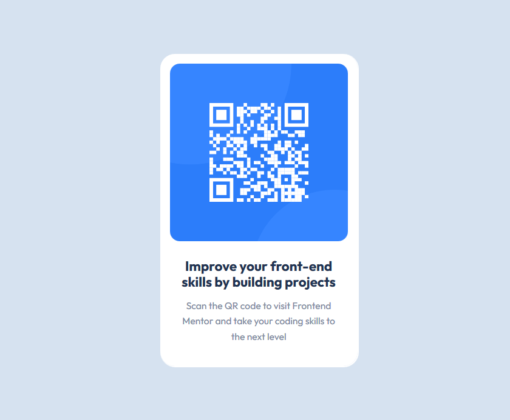

## Welcome! 👋

## Table of contents

- [Overview](The challenge)
  - [Screenshot](#screenshot)
  - [Links](#links)
- [My process](#my-process)
  - [Built with](#built-with)
  - [What I learned](#what-i-learned)
  - [Continued development](#continued-development)
  - [Useful resources](#useful-resources)
- [Author](#author)
- [Acknowledgments](#acknowledgments)

**Note: Delete this note and update the table of contents based on what sections you keep.**

## Overview
Your challenge is to build out this QR code component and get it looking as close to the design as possible.

You can use any tools you like to help you complete the challenge. So if you've got something you'd like to practice, feel free to give it a go.

- Solution URL: [Add solution URL here](https://your-solution-url.com)
- Live Site URL: [Add live site URL here](https://your-live-site-url.com)

## My process

### Built with

- Semantic HTML5 markup
- CSS custom properties
- CSS GRID

### What I learned

i Learnt how to get design layout and also how image can size relating to its component.

## Author

- Website - [Add your name here](https://github.com/Oyeyemiwole19)
- Frontend Mentor - [My-frontendmentor](https://www.frontendmentor.io/profile/Oyeyemiwole19)

**Thanks!** 🚀
